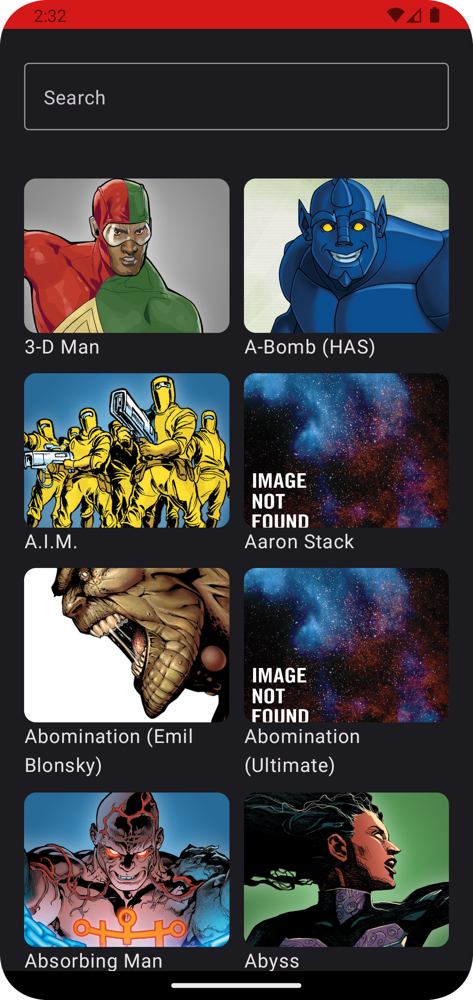
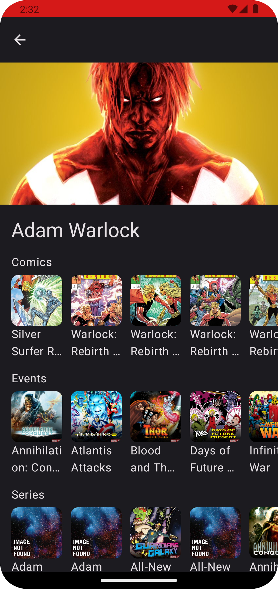

# MarveliciousAndroid

An open source Android mobile app filled with Marvel characters.

## App preview

<p>


</p>

## How to run the app for the first time?

    1. Sync Gradle
    2. Add API keys into `local.properties` file (this file exists in the root of this project)
        1. MARVEL_API_PUBLIC_KEY=xxx
        2. MARVEL_API_PRIVATE_KEY=xxx
    3. Click play

## API

The app is based on an open Marvel api https://developer.marvel.com/.

## Cloning

Clone the GitHub repository and open the project in `Android Studio`.

```
$ https://github.com/rok5ek/MarveliciousAndroid.git
```

## Author

Rok Petek, https://www.linkedin.com/in/rok-petek-4673b459/